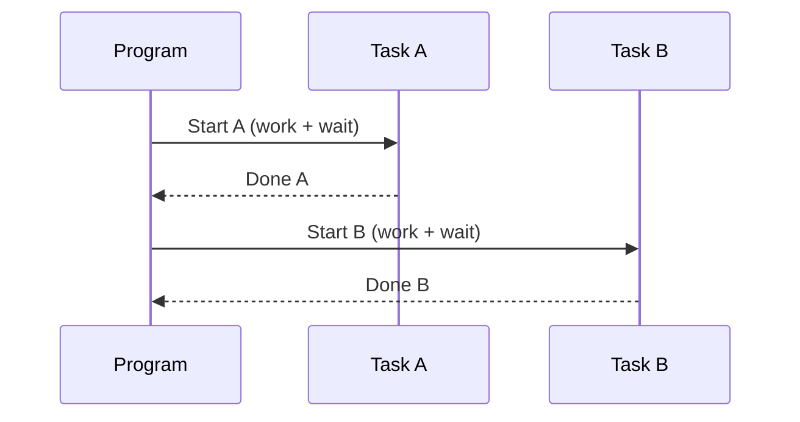
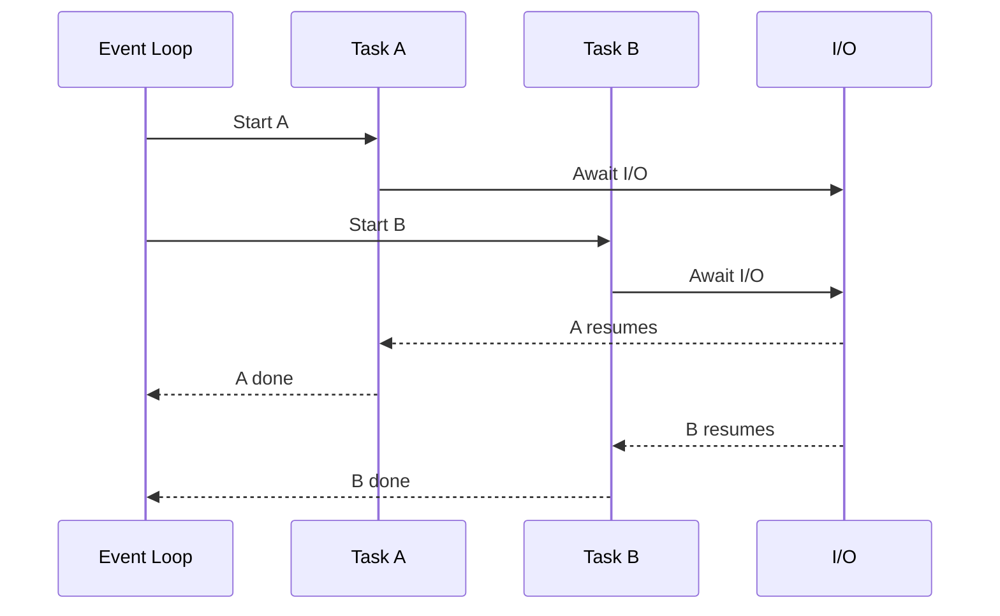

# Synchronous vs Asynchronous Programming

> A practical, GitHub-ready guide with clear examples, diagrams, and a quick decision checklist.

---

## 📚 Overview

**Synchronous programming** runs tasks **one at a time** in order. Each task **blocks** the next until it finishes.  
**Asynchronous programming** lets tasks **start, pause (while waiting), and resume**, allowing other work to proceed meanwhile. This makes programs **non-blocking** and often more efficient for I/O.

---

There are two ways to use computer resource 
1. Concurrency: parallelism using concurrency the start and stop time of multiple co-routines can overlap
2. parallelism: With parallelism different threads can execute at the same time

## 🧠 When to Use Which?

| Feature                | Synchronous (Blocking)                      | Asynchronous (Non-Blocking)                         |
|-----------------------|----------------------------------------------|-----------------------------------------------------|
| Execution order       | Strictly sequential                          | Overlapping while awaiting I/O                      |
| Efficiency            | Idle during waits                            | Uses wait time to do other work                     |
| Best for              | Simple, predictable, sequential workflows    | Network-heavy, I/O-bound, real-time, high concurrency |
| Mental model          | Easier                                       | Harder (await/async, event loop)                    |
| Typical pitfalls      | UI freeze, wasted time on I/O                | Race conditions, forgotten `await`, blocking calls  |

---

## 📝 What is Synchronous Programming?

- Tasks run **one at a time**, in the order written.  
- Each task **blocks** the next until it finishes.  
- Example: If reading a file takes 5 seconds, the program waits the full 5 seconds.

### ✅ Great for
- **Simple scripts** with small, predictable tasks  
- Strictly **sequential workflows**  
- **CPU-heavy** pipelines that must run in order (consider multiprocessing for speed)

---

## 📝 What is Asynchronous Programming?

- Tasks can **start and then pause** while waiting (e.g., network, disk, timers).  
- While one task is waiting, **others can run**.  
- Leads to **non-blocking**, **high-throughput** applications.

### ✅ Great for
- **I/O-bound** workloads:
  - Network requests (APIs, WebSockets/WebRTC, DB queries)
  - File read/write
  - User input/output
- Apps needing **high concurrency**:
  - Chat/messaging
  - Video/streaming
  - Real-time dashboards

---

## 🔄 Visual Intuition

### Synchronous Timeline


### Asynchronous Timeline


---

## 🐍 Python Examples

### Synchronous (Blocking)
```python
import time

def task(name, seconds):
    print(f"Start {name}")
    time.sleep(seconds)  # blocks the whole thread
    print(f"End {name}")

task("A", 2)
task("B", 2)
# Total ~4s
```

### Asynchronous with `asyncio` (Non-Blocking I/O)
```python
import asyncio

async def task(name, seconds):
    print(f"Start {name}")
    await asyncio.sleep(seconds)  # yields control to the event loop
    print(f"End {name}")

async def main():
    await asyncio.gather(
        task("A", 2),
        task("B", 2),
    )

asyncio.run(main())
# Total ~2s
```

> **Tip:** `await` only helps when the awaited work *releases control* (e.g., network, file I/O, timers). CPU-bound code won’t speed up with `await`.

---

## ⚙️ Python Execution Model Cheat Sheet

- **Multiprocessing** → Multiple **processes**. Best for **CPU-bound** tasks (true parallelism).  
- **Threading** → Multiple **threads** in one process. Best for **I/O-bound** tasks that block.  
- **Asyncio** → Single-threaded **event loop** with **cooperative multitasking** (great for managing many I/O-bound tasks).

> Rule of thumb:
> - CPU-bound → **multiprocessing**
> - I/O-bound (blocking libs) → **threading**
> - I/O-bound (async-friendly libs) → **asyncio**

---

## 🧩 Coroutines (Python)

A **coroutine** is a function defined with `async def` that can **pause** (`await`) and **resume** later. This enables **concurrency** in a single thread via the event loop.

```python
async def fetch_user(id):
    # await an async HTTP call, DB query, or file read
    ...
```

- `await` lets other tasks run while this coroutine waits.
- Use `asyncio.gather()` to run multiple coroutines concurrently.
- Never call a coroutine directly—**await** it or schedule it with the loop.

---

## 🧭 Quick Decision Checklist

- Is the work **I/O-bound** and you need to handle **many** tasks? → **Asyncio**
- Is the work **CPU-bound** and needs parallel speedup? → **Multiprocessing**
- Do you depend on **blocking libraries** with I/O? → **Threading** (or find async-compatible libs)
- Is the script **simple** and sequential? → **Synchronous** is fine

---

## ⚠️ Common Pitfalls (and Fixes)

- **Blocking inside async**: Using `time.sleep()` or heavy CPU in `async` code stalls the loop.  
  - ✅ Use `await asyncio.sleep()` or offload CPU to a process pool.
- **Forgetting `await`**: Calling a coroutine without `await` creates a coroutine object that never runs.  
  - ✅ Always `await` or use `asyncio.create_task()`.
- **Mixing models accidentally**: Starting threads/processes inside async without care can create race conditions.  
  - ✅ Be deliberate: isolate models with clear boundaries (e.g., use `to_thread()` helpers).
- **Synchronous libraries** in async code: They block the event loop.  
  - ✅ Prefer async equivalents (e.g., `aiohttp`, `asyncpg`) or run sync work in threads.

---

## 🔧 Practical Patterns

### Run sync function without blocking the loop
```python
import asyncio

def blocking_calc(x):
    # heavy CPU or blocking I/O
    return x * x

async def main():
    result = await asyncio.to_thread(blocking_calc, 42)
    print(result)

asyncio.run(main())
```

### Schedule background tasks
```python
import asyncio

async def worker():
    while True:
        print("tick")
        await asyncio.sleep(1)

async def main():
    task = asyncio.create_task(worker())
    await asyncio.sleep(3)
    task.cancel()
    try:
        await task
    except asyncio.CancelledError:
        print("worker cancelled")

asyncio.run(main())
```

---

## ✅ Summary

- Use **synchronous** code for **simple, sequential** tasks or quick scripts.  
- Use **asynchronous** code for **I/O-bound** workloads and **high concurrency**.  
- For **CPU-bound** parallelism, prefer **multiprocessing**.  
- In Python, coroutines (`async def` + `await`) power efficient, single-threaded concurrency.

---

## 📎 Appendix: Mini Glossary

- **Blocking**: A call that halts the current thread until it finishes.  
- **Non-blocking**: A call that returns control immediately (often with a promise/future/coroutine).  
- **Event loop**: The scheduler that runs and resumes coroutines.  
- **Coroutine**: An `async def` function that can be paused/resumed via `await`.

---
